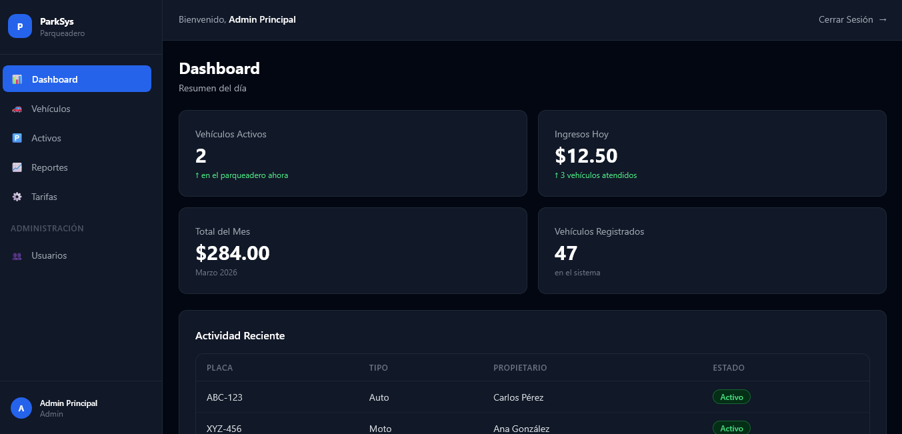
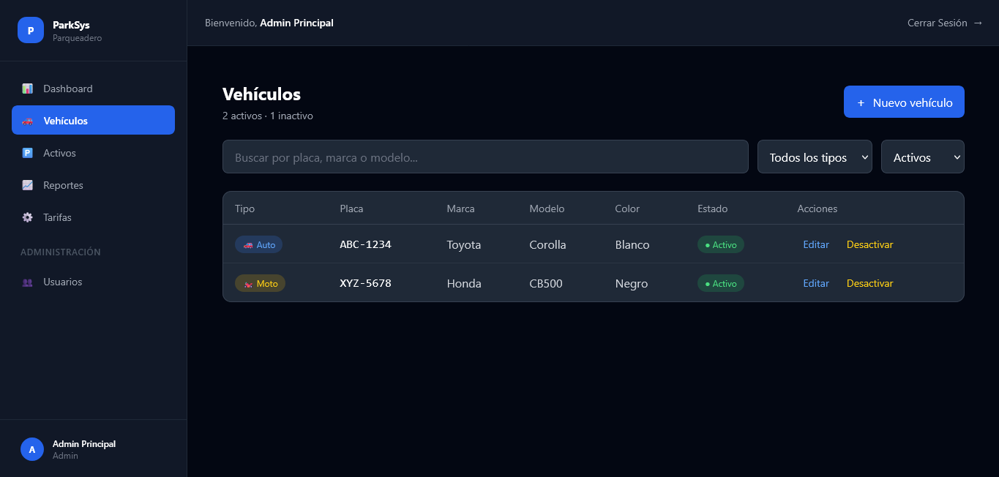

# ParkSys 🅿️

Sistema de gestión de parqueadero desarrollado para un cliente real.
Permite registrar vehículos, controlar entradas/salidas y generar reportes de ingresos.

## 🚀 Demo en vivo
> Próximamente

## 📸 Screenshots




## 🛠️ Stack tecnológico

| Tecnología | Uso |
|-----------|-----|
| React 18 + TypeScript | Frontend |
| Vite | Bundler |
| Tailwind CSS | Estilos |
| Zustand | Estado global |
| React Router DOM | Navegación |
| React Hook Form | Formularios |
| Recharts | Gráficos |
| Node.js + Express | Backend (semana 4) |
| SQL Server | Base de datos (semana 4) |

## ✅ Funcionalidades

- [x] Autenticación con JWT y roles (admin/user)
- [x] Dashboard con KPIs en tiempo real
- [x] Gestión de vehículos (CRUD completo)
- [x] Registro de entradas y salidas
- [x] Cálculo automático de tarifas por hora
- [ ] Reportes mensuales con gráficos (semana 3)
- [ ] Deploy en Vercel + Railway (semana 5)

## ⚙️ Instalación local
```bash
git clone https://github.com/Petersao19/parksys.git
cd parksys
npm install
npm run dev
```

## 👤 Credenciales de prueba

| Rol | Email | Contraseña |
|-----|-------|-----------|
| Admin | admin@parking.com | admin123 |
| Usuario | user@parking.com | user123 |

## 📁 Estructura del proyecto
```
src/
├── components/    # Componentes reutilizables
├── pages/         # Páginas de la app
├── store/         # Estado global (Zustand)
├── hooks/         # Custom hooks
├── services/      # Llamadas a la API
├── types/         # Tipos TypeScript
└── utils/         # Funciones utilitarias
```

## 📄 Licencia
MIT